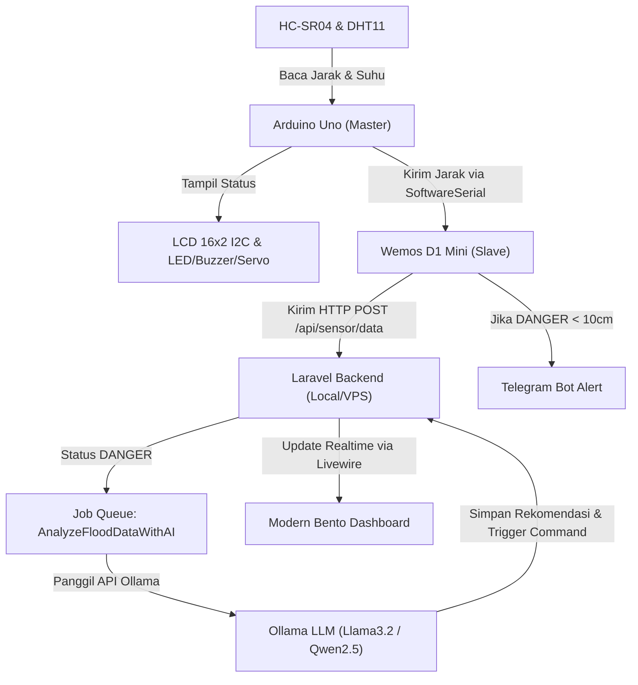

# 🔌 Bedadung SFEWS — Skema Wiring & Panduan Persiapan IoT

Dokumen ini berisi panduan lengkap tata cara merangkai komponen hardware **Arduino Uno + Wemos D1 Mini** serta mengintegrasikannya dengan **Laravel Backend + Ollama AI + Telegram Bot**.

---

## 📋 1. Daftar Komponen & Pinout Wiring

### **A. Sensor Ultrasonic (HC-SR04)** — Deteksi Ketinggian Air
| Pin HC-SR04 | Hubungkan Ke | Keterangan |
|---|---|---|
| `VCC` | Rel Merah Breadboard (+5V) | Daya 5V |
| `GND` | Rel Biru Breadboard (- GND) | Ground bersama |
| `TRIG` | **Pin D2 Arduino** | Pemicu gelombang suara |
| `ECHO` | **Pin D3 Arduino** | Penerima pantulan suara |

---

### **B. Modul Traffic Light LED (Merah, Kuning, Hijau)** — Indikator Visual Status
| Pin LED Module | Hubungkan Ke | Keterangan |
|---|---|---|
| `GND` | Rel Biru Breadboard (- GND) | Ground bersama |
| `R` (Red) | **Pin D4 Arduino** | Lampu Merah (Status DANGER < 10cm) |
| `Y` (Yellow) | **Pin D5 Arduino** | Lampu Kuning (Status CAUTION 10-20cm) |
| `G` (Green) | **Pin D6 Arduino** | Lampu Hijau (Status SAFE > 20cm) |

---

### **C. Sensor Suhu & Kelembaban (DHT11)** — Metrik Lingkungan
| Pin DHT11 | Hubungkan Ke | Keterangan |
|---|---|---|
| `VCC` | Rel Merah Breadboard (+5V) | Daya 5V |
| `GND` | Rel Biru Breadboard (- GND) | Ground bersama |
| `DATA` | **Pin D7 Arduino** | Baca suhu & kelembaban |

---

### **D. Modul Buzzer 3-Pin** — Sirene & Alarm Suara
| Pin Buzzer | Hubungkan Ke | Keterangan |
|---|---|---|
| `-` (Kiri) | Rel Biru Breadboard (- GND) | Ground bersama |
| `Tengah` | Rel Merah Breadboard (+5V) | Daya 5V (opsional, GND aman) |
| `S` (Kanan) | **Pin D8 Arduino** | Frekuensi nada alarm/sirene |

---

### **E. Servo Motor SG90** — Simulasi Pintu Air Otomatis
| Kabel Servo | Hubungkan Ke | Keterangan |
|---|---|---|
| Cokelat | Rel Biru Breadboard (- GND) | Ground bersama |
| Merah | Rel Merah Breadboard (+5V) | Daya 5V |
| Oranye | **Pin D9 Arduino** | Sinyal PWM (0° Tutup / 90° Buka) |

---

### **F. LCD 16x2 dengan Modul I2C** — Tampilan Status Lokal
| Pin LCD I2C | Hubungkan Ke | Keterangan |
|---|---|---|
| `GND` | Rel Biru Breadboard (- GND) | Ground bersama |
| `VCC` | Rel Merah Breadboard (+5V) | Daya 5V |
| `SDA` | **Pin A4 Arduino** | Jalur Data I2C |
| `SCL` | **Pin A5 Arduino** | Jalur Clock I2C |

---

### **G. Wemos D1 Mini (ESP8266)** — Bridge WiFi, API Laravel & Telegram
| Pin Wemos D1 | Hubungkan Ke | Keterangan |
|---|---|---|
| `5V` / `VIN` | Rel Merah Breadboard (+5V) | Sumber daya Wemos |
| `G` (GND) | Rel Biru Breadboard (- GND) | **WAJIB GND BERSAMA dengan Arduino!** |
| `D5` (RX) | **Pin D13 Arduino (TX)** | Terima data serial dari Arduino |
| `D6` (TX) | **Pin D12 Arduino (RX)** | Kirim command serial ke Arduino |

> [!IMPORTANT]
> **PENTING (Common Ground):** Pin `GND` Arduino Uno dan `GND` Wemos D1 Mini **WAJIB dihubungkan pada rel GND yang sama** di breadboard. Tanpa Common Ground, komunikasi Serial antara Arduino dan Wemos akan mengalami error/garbage characters.

---

## 🛠️ 2. Persiapan Sebelum Mengunggah Program (Uploading)

### **A. Persiapan Arduino IDE:**
1. Install **Arduino IDE** (versi 1.8.x atau 2.x).
2. Di Arduino IDE, buka **Tools > Board Manager** dan install:
   - `esp8266` by ESP8266 Community (untuk mengunggah ke Wemos D1 Mini).
3. Buka **Sketch > Include Library > Manage Libraries** dan install library berikut:
   - `LiquidCrystal I2C` (by Frank de Brabander)
   - `Servo` (built-in Arduino)
   - `DHT sensor library` (by Adafruit) + `Adafruit Unified Sensor`
   - `UniversalTelegramBot` (by Brian Lough)
   - `ArduinoJson` (by Benoit Blanchon - versi 6.x)

---

### **B. Langkah Upload Program:**

1. **Upload ke Arduino Uno:**
   - Buka file [`sketch_master.ino`](file:///c:/Users/kkhad/Desktop/WFK-KNU/sketch_master.ino).
   - Pilih Board: **Arduino Uno**.
   - Pilih Port COM Arduino.
   - Klik **Upload**.

2. **Upload ke Wemos D1 Mini:**
   - Buka file [`wemos_slave.ino`](file:///c:/Users/kkhad/Desktop/WFK-KNU/wemos_slave.ino).
   - Edit bagian berikut di paling atas program:
     ```cpp
     const char* ssid     = "NAMA_WIFI_LO";      // Wi-Fi / Hotspot HP
     const char* password = "PASSWORD_WIFI_LO";  // Password Wi-Fi
     #define BOTtoken "TOKEN_BOT_TELEGRAM_LO"    // Dapet dari @BotFather
     #define CHAT_ID  "CHAT_ID_TELEGRAM_LO"     // Dapet dari @myidbot
     ```
   - Pilih Board: **LOLIN(WEMOS) D1 R2 & mini** (atau NodeMCU 1.0).
   - Pilih Port COM Wemos.
   - Klik **Upload**.

---

## 🔄 3. Alur Kerja Sistem Bedadung SFEWS



---

## 🧪 4. Cara Pengujian Lokal (Tanpa Alat Terpasang)

Jika hardware belum dirangkai tetapi ingin menguji sistem software & dashboard:

1. Jalankan server Laravel di terminal root:
   ```bash
   php artisan serve --port=8000
   ```
2. Buka terminal baru dan jalankan simulator sensor:
   ```bash
   # Mode simulasi air pasang-surut otomatis:
   php artisan sfews:simulate --auto

   # Atau tes 1x bacaan DANGER:
   php artisan sfews:simulate --distance=7.5
   ```
3. Buka browser di [http://127.0.0.1:8000](http://127.0.0.1:8000) untuk melihat pembaruan data & grafik secara real-time.
